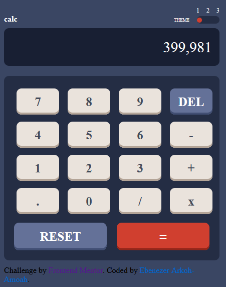

<h1 align="center">SImple Calculator Application</h1>

 

  <h3>
    <a href="https://www.figma.com/file/dpxDm66txBIjrxUTesVLXx/calculator-app-1">
      Designs
    </a>
     |
     <a href="https://eben-arkoh-amoah.github.io/Frontend-mentor-calculator-app/">
      Demo
    </a>
     | 
    <a href="https://github.com/eben-arkoh-amoah/Frontend-mentor-calculator-app">
      GitHub
    </a>
    
  </h3>

 

<!-- OVERVIEW -->

## Overview

This appliction  simple calculator which can be used for simple mathematical calculations. It also
allows the user to switch between three color themes . 

## About the Project

This is a  calculator application project I was assigned to build as part of my software devepment training prgram to challenge and give   me a hand-on practice on the theories I have learnt in javascript during the javascript phase of the training.

## How the application works
The application has two main sections.  The first section allows the user to switch between colour themes . It has numbers 1 , 2 and three where each one of them corresponds to a color theme. These numbers serve as the button for switching between different color themes. 
The second section consists of a screen which displays value(s) to a user and a keyboard with input keys where a user may compute his values.
## Tasks

- Prototype : consists well structured html styled with  css stylesheet which is user interactive 
with the help of javascript.

## Built With

- [html](https://www.w3schools.com)
- [css](https://css-tricks.com)
- [javascript](https://www.codecademy.com)
## Author
Name: Ebenezer Arkoh-Amoah

